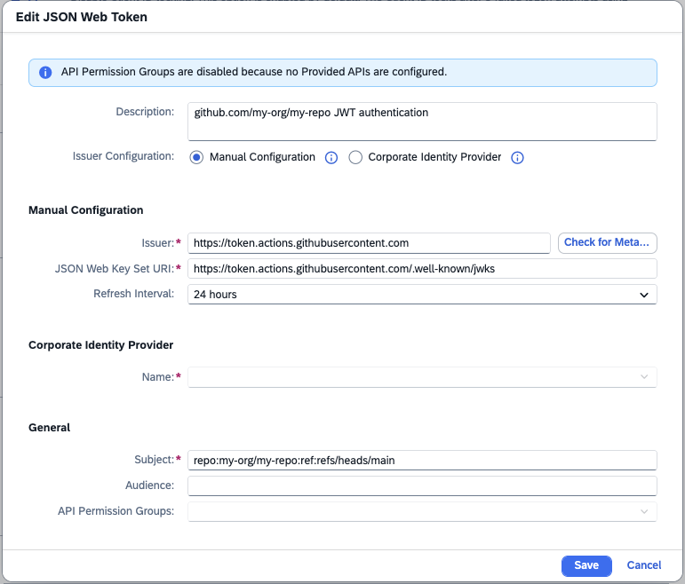

# ⚒️ Setup

# Prerequisites

- You have a repository which contains a solution developed with Joule Studio or Joule Pro Code.
    You want to automate the deployment of this solution.

# Setup Steps

## Allowing the Use of Actions

TBD

https://docs.github.com/en/repositories/managing-your-repositorys-settings-and-features/enabling-features-for-your-repository/managing-github-actions-settings-for-a-repository#allowing-select-actions-and-reusable-workflows-to-run

## Configuring the SAP Cloud Identity Services Tenant

To authenticate against Joule Studio, the workflow uses a GitHub-issued JWT that is exchanged for a Cloud Identity issued JWT.

To enable this exchange, a configuration must be done in the Cloud Identity services tenant.

Here, we describe the necessary Joule Studio specific steps.
They are done in the admin console of the Cloud Identity services tenant.

1. Define an application representing the GitHub organisation

    In the section `Application & Resources` choose the tile `Applications`.
    Click `Create`.
    Fill out the dialog:

    

    The placeholder "my-org" is replaced with your GitHub organisation.
    Click "Save" and select the created application.

1. Define a dependency to the Joule Studio application

    Again in the tab `Trust` under `Application APIs` select `Dependencies`.

    Click `Add`.
    Fill out the dialog:

    

    Click `Save`.

    For more details, see the [Cloud Identity services documentation on Integrating Applications][help.sap---integrating-applications].

1. Specify trust with your GitHub repository.

    In the tab `Trust` in the section `Application APIs` select `Client Authentication`.
    Scroll down to `JSON Web Tokens`. Click the `Add` Button.

    Fill out the dialog:

    

    This is the token issuer URL for `github.com`:

        https://token.actions.githubusercontent.com

    Enter it in the field `Issuer` and click `Check for Metadata`. The field `JSON Web Key Set URI` will be populated automatically.

    Here is the template for the subject:

        repo:MY-ORG/MY-REPO:ref:refs/heads/main

    The placeholders "MY-ORG" and "MY-REPO" are to be replaced with your GitHub organisation and repository.

    Click "Save".

    Under `Client Authentication` the client ID is displayed.
    It is needed to define the `SCI_CLIENT_ID` variable below.

    For more details, see the [Cloud Identity services documentation on JWT bearer flows][help.sap--jwt-bearer-flow].

### Customizing the GitHub JWT Subject Claim

By default, JWTs issued by GitHub have the following subject claim:

    repo:MY-ORG/MY-REPO:ref:refs/heads/main

i.e. they include the organisation, the repository and the branch.
This means that for each repository containing a solution to be deployed to Joule Studio,
a `Client Authentication` must be configured in the Cloud Identity services tenant.

For an organisation with many repositories, that might be undesirable.
To avoid this, you can configure a subject customization template as described in the [GitHub documentation][github--customize-subject].

For example, the following API call

```bash
curl -L \
  -X PUT \
  -H "Accept: application/vnd.github+json" \
  -H "Authorization: Bearer <YOUR-TOKEN>" \
  -H "X-GitHub-Api-Version: 2022-11-28" \
  http(s)://HOSTNAME/api/v3/orgs/MY-ORG/actions/oidc/customization/sub \
  -d '{"include_claim_keys":["repository_owner","context"]}'
```

would yield a subject claim:

  repository_owner:MY-ORG:ref:refs/heads/main

for _all_ repositories under `MY-ORG`.


### Security Implications

The configurations outlined above allow certain GitHub workflows access to Joule Studio.
Review your settings carefully to understand which repositories and workflows will gain access.

For example, when setting a custom subject template at the organisation level that does not include the repository, you need to carefully control who can create new repositories in the organisation.


## Creating the Workflow

The following workflow deploys a solution to Joule Studio.
It reads its configuration from repository variables and uses the following Joule Actions.

```yaml
name: Deploy to Joule Studio

on:
  workflow_dispatch:

jobs:
  deploy:
    runs-on: ubuntu-latest
    permissions:
      id-token: write  # required for requesting the JWT
      contents: read   # required for actions/checkout
    steps:
      - name: Checkout repository
        uses: actions/checkout@v4

      - name: Setup Joule Studio CLI
        uses: github.com/SAP/lifecycle-operation-actions-for-joule-studio/actions/setup-jl

      - name: Fetch SCI token
        id: fetch-token
        uses: github.com/SAP/lifecycle-operation-actions-for-joule-studio/actions/token-fetch@main
        with:
          sciTenantUrl: ${{ vars.SCI_TENANT_URL }}
          sciClientId: ${{ vars.SCI_CLIENT_ID }}

      - name: Build solution
        id: zip-solution
        uses: github.com/SAP/lifecycle-operation-actions-for-joule-studio/actions/build@main


      - name: Deploy solution
        uses: github.com/SAP/lifecycle-operation-actions-for-joule-studio/actions/deploy@main
        with:
          sciToken: ${{ steps.fetch-token.outputs.sciToken }}
          jouleStudioUrl: ${{ vars.JOULE_STUDIO_URL }}
          solutionZip: ${{ steps.zip-solution.outputs.solutionZip }}
```

### Configuring Repository Variables

The workflow reads three variables from the GitHub repository.
Set them under **Settings → Secrets and Variables → Actions → Variables**:

| Variable | Description |
|---|---|
| `SCI_TENANT_URL` | Issuer URI of the SAP Cloud Identity Services tenant (e.g. `https://my-tenant.accounts.ondemand.com`) |
| `SCI_CLIENT_ID` | Client ID of the SCI application created in the step above. |
| `JOULE_STUDIO_URL` | Base URL of the Joule Studio solution handling API. You can find it in Joule Studio, under `Settings` -> `Develop`. |


[help.sap--jwt-bearer-flow]: https://help.sap.com/docs/cloud-identity-services/cloud-identity-services/using-jwt-bearer-flow?version=Cloud
[help.sap---integrating-applications]: https://help.sap.com/docs/cloud-identity-services/cloud-identity-services/integrating-applications?version=Cloud&q=dependencies
[github--customize-subject]: https://docs.github.com/en/enterprise-server@3.12/actions/security-for-github-actions/security-hardening-your-deployments/about-security-hardening-with-openid-connect#customizing-the-subject-claims-for-an-organization-or-repository
